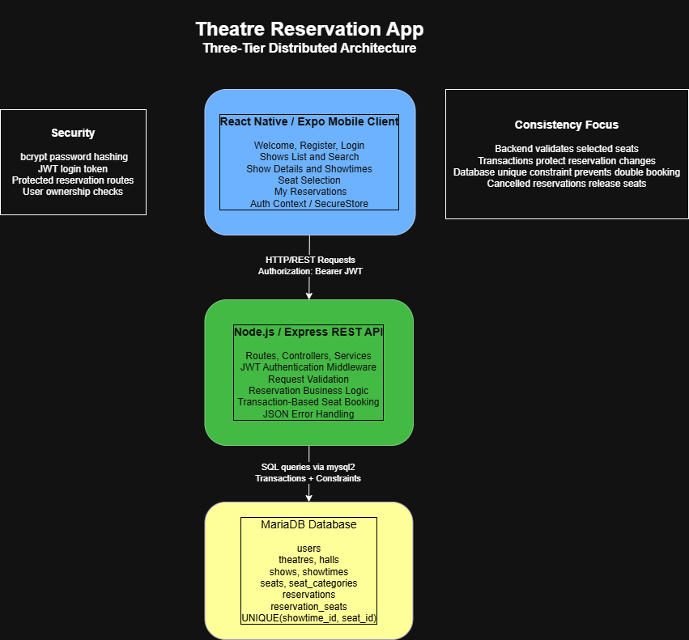
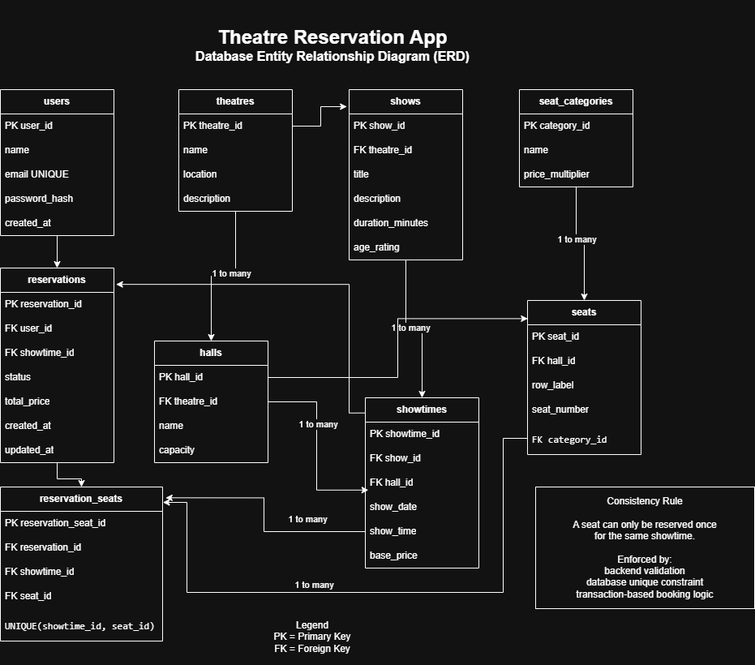

# Theatre Reservation App

**Three-tier mobile distributed system for theatre seat reservations.**

This project was developed for **CN6035 — Mobile & Distributed Systems** as a complete, submission-ready mobile distributed application. It demonstrates a realistic theatre booking workflow in which a **React Native / Expo mobile client** communicates with a **Node.js / Express REST API**, which persists data in a **MariaDB relational database**.

The project goes beyond a basic CRUD implementation by focusing on **JWT authentication**, **seat-level availability**, **transaction-based reservation logic**, **double-booking prevention**, **reservation editing and cancellation**, and **end-to-end evidence through screenshots, regression testing, PowerPoint slides, demo script, and video demonstration**.

---

## Final Submission Package

| Evidence / Deliverable | Location |
|---|---|
| Final PowerPoint presentation | [`docs/presentation/CN6035_2678447_Theatre_Reservation_Presentation.pptx`](docs/presentation/CN6035_2678447_Theatre_Reservation_Presentation.pptx) |
| Demo video | [`docs/presentation/theatre_reservation_demo.mp4`](docs/presentation/theatre_reservation_demo.mp4) |
| Demo script | [`docs/presentation/demo_script.md`](docs/presentation/demo_script.md) |
| Architecture diagram | [`docs/diagrams/architecture_diagram.png`](docs/diagrams/architecture_diagram.png) |
| Database ERD | [`docs/diagrams/database_erd.png`](docs/diagrams/database_erd.png) |
| Backend regression evidence | [`docs/screenshots/backend/16_day4_backend_regression_pass.png`](docs/screenshots/backend/16_day4_backend_regression_pass.png) |
| Frontend reservation flow evidence | [`docs/screenshots/frontend/15_day4_frontend_reservation_flow_pass.png`](docs/screenshots/frontend/15_day4_frontend_reservation_flow_pass.png) |
| Frontend cancelled history evidence | [`docs/screenshots/frontend/16_day4_frontend_cancelled_history_pass.png`](docs/screenshots/frontend/16_day4_frontend_cancelled_history_pass.png) |

---

## Demo Video

The final demo video shows the complete working flow of the application:

```text
Login
→ Browse shows
→ Search
→ Open show details
→ Select showtime and seats
→ Create reservation
→ View My Reservations
→ Edit reservation
→ Cancel reservation
→ Confirm cancelled reservation history
```

Watch or download the video from:

[**Watch demo video — theatre_reservation_demo.mp4**](docs/presentation/theatre_reservation_demo.mp4)

The video is also embedded in the final PowerPoint presentation and is supported by the demo script in `docs/presentation/demo_script.md`.

---

## Technical Highlights

- **Three-tier distributed architecture:** React Native / Expo frontend, Express REST API, MariaDB database.
- **Secure user access:** bcrypt password hashing, JWT authentication, protected routes, and ownership checks.
- **Realistic seat booking:** users select specific seats, not only a number of tickets.
- **Consistency-focused reservation logic:** backend validation, database transactions, and `UNIQUE(showtime_id, seat_id)`.
- **Cancellation with seat release:** cancelled reservations remain visible in history while linked seats become available again.
- **Professional evidence package:** final README, diagrams, screenshots, regression testing output, PowerPoint, demo video, and demo script.

---

## Project Overview

The **Theatre Reservation App** allows users to browse theatre performances, view available showtimes, select specific seats, and manage their own reservations through a mobile-first application.

The application supports a realistic theatre booking workflow:

- user registration and login,
- JWT-protected access to reservation features,
- browsing of available theatres and performances,
- search by show title, theatre name, location, and show date,
- show details with available dates, times, halls, and prices,
- seat availability per selected showtime,
- creation of reservations for one or more specific seats,
- user reservation history,
- editing of future reservations,
- cancellation of future reservations,
- retention of cancelled reservations in the user history.

The main technical focus is not only basic CRUD functionality. The project also demonstrates **JWT authentication**, **secure frontend token persistence**, **seat-level availability**, **transaction-based reservation logic**, **double-booking prevention**, and **data consistency across a distributed mobile-client/API/database system**.

---

## Coursework Alignment

The project is aligned with the CN6035 coursework requirements and assessment criteria.

| Assessment Area | Weight | Project Evidence |
|---|---:|---|
| Frontend | 30% | React Native / Expo frontend with consistent UI, authentication flow, protected navigation, backend communication, search, show details, showtime preview, seat selection, reservation creation, edit/cancel flow, and user feedback states |
| Backend | 20% | Node.js / Express REST API with routes, controllers, services, middleware, JWT authentication, validation, transaction-based reservation logic, and MariaDB integration |
| Database | 20% | MariaDB schema with normalized tables, primary keys, foreign keys, indexes, unique constraints, seed data, and reservation-seat relationship for consistency |
| Presentation | 30% | README documentation, architecture evidence, backend/frontend screenshots, Postman evidence, PowerPoint slides, demo video, and live demo script |

The implemented system follows the required distributed model:

```text
React Native / Expo Mobile Client
        ↓ HTTP/REST + JWT
Node.js / Express REST API
        ↓ SQL queries
MariaDB Database
```

---

## Key Features

### Authentication and User Access

- User registration with name, email, and password
- User login with email and password
- Password hashing with bcrypt on the backend
- JWT-based authentication for protected routes
- Protected frontend navigation after login
- Token persistence through the frontend authentication context and secure storage flow
- Logout functionality
- User feedback for validation, success, and error cases

### Theatre Catalogue and Search

- List of available theatre performances loaded from the backend
- Search by show title, theatre name, location, and show date
- Empty-state UI when no results are found
- Loading and error states during backend communication
- Consistent show cards with title, theatre, location, duration, age rating, and description

### Show Details and Availability

- Dedicated show details screen
- Display of title, theatre, location, description, duration, and age rating
- Preview of available showtimes before seat selection
- Display of showtime date/time, hall name, and starting price
- Navigation from show details to the complete seat selection workflow

### Seat Selection and Reservation Creation

- Showtimes loaded from the backend
- Seats loaded per selected showtime
- Seat availability displayed visually
- Unavailable seats disabled
- Selected seats highlighted
- Live total price calculation
- Create reservation request sent to the backend
- Success feedback after booking
- Seat availability refreshed after reservation creation

### User Reservation Management

- My Reservations screen for the authenticated user
- Upcoming reservations section
- Past / cancelled reservations section
- Reservation details: title, theatre, location, date/time, seats, total price, status, and type
- Edit future reservation flow
- Cancel future reservation flow
- Confirmation dialog before cancellation
- Cancelled reservations retained in history

### Consistency and Double-Booking Protection

- Seat availability checked before reservation creation and editing
- Backend transaction logic protects reservation operations
- Database-level unique constraint prevents the same seat from being confirmed twice for the same showtime
- Duplicate database insert attempts are converted into user-friendly conflict responses
- Cancelled reservations keep their history record while releasing their linked seats for future bookings

---

## Tech Stack

### Frontend

- React Native
- Expo
- JavaScript
- Axios
- React Navigation
- Expo SecureStore / frontend authentication context for token persistence
- Reusable UI components: `AppButton`, `AppInput`, `FeedbackMessage`, `LoadingView`

### Backend

- Node.js
- Express
- mysql2
- bcrypt
- jsonwebtoken
- dotenv
- cors
- nodemon

### Database

- MariaDB
- SQL schema with primary keys, foreign keys, indexes, unique constraints, and normalized reservation structure

### Development and Testing Tools

- WebStorm / Visual Studio Code
- HeidiSQL / MariaDB client
- Postman
- Git
- GitHub

---

## System Architecture

The application follows a three-tier distributed architecture.

```text
┌──────────────────────────────────────┐
│ React Native / Expo Mobile Client    │
│ - UI screens                         │
│ - Auth context                       │
│ - Axios API service                  │
│ - Secure token handling              │
└───────────────────┬──────────────────┘
                    │ HTTP/REST + JWT
                    v
┌──────────────────────────────────────┐
│ Node.js / Express REST API           │
│ - Routes                             │
│ - Controllers                        │
│ - Services                           │
│ - JWT middleware                     │
│ - Error handling                     │
└───────────────────┬──────────────────┘
                    │ SQL queries via mysql2
                    v
┌──────────────────────────────────────┐
│ MariaDB Database                     │
│ - Users                              │
│ - Theatres                           │
│ - Halls                              │
│ - Shows / showtimes                  │
│ - Seats / categories                 │
│ - Reservations / reservation seats   │
└──────────────────────────────────────┘
```

Supporting diagrams are stored in:

```text
docs/diagrams/
```

Recommended exported diagram files for the final submission package:

```text
docs/diagrams/architecture_diagram.png
docs/diagrams/database_erd.png
```

### Architecture Diagram



### Frontend Layer

The frontend provides the mobile user interface for registration, login, protected navigation, theatre browsing, search, show details, showtime preview, seat selection, reservation confirmation, user reservation history, future reservation editing, and future reservation cancellation.

The UI is mobile-first. When tested through Expo web, the main content is constrained with a clean card layout so the app still looks professional on a desktop screen while preserving the mobile application design.

### Backend Layer

The backend exposes REST API endpoints and handles request validation, user authentication, JWT verification, business logic, ownership checks, transaction-based booking, seat availability checks, database queries, and consistent JSON error handling.

The backend is organised into:

```text
routes/
controllers/
services/
middleware/
db/
utils/
```

### Database Layer

The MariaDB database stores all core entities: users, theatres, halls, shows, showtimes, seat categories, seats, reservations, and reservation seats.

---

## Project Structure

```text
theatre-reservation-app/
├─ backend/
│  ├─ src/
│  │  ├─ controllers/
│  │  ├─ db/
│  │  ├─ middleware/
│  │  ├─ routes/
│  │  ├─ services/
│  │  ├─ utils/
│  │  └─ app.js
│  ├─ .env.example
│  ├─ package.json
│  └─ server.js
│
├─ frontend/
│  ├─ src/
│  │  ├─ components/
│  │  │  ├─ AppButton.js
│  │  │  ├─ AppInput.js
│  │  │  ├─ FeedbackMessage.js
│  │  │  └─ LoadingView.js
│  │  ├─ context/
│  │  │  └─ AuthContext.js
│  │  ├─ navigation/
│  │  │  └─ RootNavigator.js
│  │  ├─ screens/
│  │  │  ├─ WelcomeScreen.js
│  │  │  ├─ RegisterScreen.js
│  │  │  ├─ LoginScreen.js
│  │  │  ├─ ShowsScreen.js
│  │  │  ├─ ShowDetailsScreen.js
│  │  │  ├─ SeatSelectionScreen.js
│  │  │  └─ MyReservationsScreen.js
│  │  ├─ services/
│  │  │  └─ api.js
│  │  └─ utils/
│  │     └─ showFormatters.js
│  ├─ App.js
│  ├─ app.json
│  ├─ package.json
│  └─ package-lock.json
│
├─ database/
│  ├─ schema.sql
│  └─ seed.sql
│
├─ docs/
│  ├─ diagrams/
│  ├─ postman/
│  ├─ screenshots/
│  │  ├─ backend/
│  │  └─ frontend/
│  └─ presentation/
│
└─ README.md
```

---

## Database Design

The database schema is designed around realistic theatre seat reservations. The ERD documents how users, theatres, halls, shows, showtimes, seats, reservations, and reservation-seat links are connected.



### Main Tables

| Table | Purpose |
|---|---|
| `users` | Stores registered users |
| `theatres` | Stores theatre venues |
| `halls` | Stores theatre halls/stages |
| `shows` | Stores theatre performances |
| `showtimes` | Stores available dates and times |
| `seat_categories` | Stores Standard, Premium, and VIP seat categories |
| `seats` | Stores physical seats per hall |
| `reservations` | Stores reservation records |
| `reservation_seats` | Stores active selected seats for confirmed reservations |

### Key Relationships

- One theatre can have many halls.
- One theatre can host many shows.
- One show can have many showtimes.
- One hall has many seats.
- One reservation belongs to one user.
- One reservation belongs to one showtime.
- One reservation can contain one or more selected seats.
- Active selected seats are linked to reservations through `reservation_seats`.

### Seed Data

The seed data creates realistic demo content for backend testing, frontend development, screenshots, and live presentation.

| Entity | Count |
|---|---:|
| Theatres | 3 |
| Halls | 6 |
| Shows | 6 |
| Showtimes | Multiple future demo showtimes |
| Seat categories | 3 |
| Seats | 105 |

---

## Seat Availability and Double-Booking Prevention

A key design decision is the use of a dedicated `reservation_seats` table.

This table links a confirmed reservation with its selected seats and includes a database-level unique constraint:

```sql
UNIQUE KEY uq_showtime_seat (showtime_id, seat_id)
```

This means that the same physical seat cannot be inserted twice for the same showtime.

### How Seat Availability Is Loaded

When the frontend opens the seat selection screen, it requests seat availability for a selected showtime:

```http
GET /seats?showtimeId=<id>
```

The backend returns all seats for the relevant hall and marks each one as available or unavailable. A seat is unavailable when it is linked to a **confirmed** reservation for the same showtime.

The frontend then displays:

- available seats as selectable,
- unavailable seats as disabled,
- selected seats with a separate visual state,
- total price calculated from the selected seat prices.

### Application-Level Validation

Before a reservation is created or updated, the backend validates that:

1. the showtime exists,
2. the showtime is in the future,
3. all selected seats belong to the correct hall,
4. the selected seats are not already linked to another confirmed reservation,
5. the authenticated user is allowed to manage the reservation.

This prevents most invalid reservation attempts before the database insert/update is executed.

### Transaction-Based Reservation Logic

Reservation creation and editing are handled inside database transactions.

```text
START TRANSACTION
1. Lock and validate the selected showtime.
2. Validate the selected seats for the showtime hall.
3. Check current seat availability.
4. Insert or update the reservation record.
5. Insert the selected seats into reservation_seats.
6. Commit the transaction.
```

If any validation fails, the transaction is rolled back:

```text
ROLLBACK
```

This is important in a distributed system because the mobile client, API server, and database operate as separate tiers. Two users may attempt to reserve the same seat at almost the same time. Application-level validation reduces invalid requests, while the database unique constraint acts as the final consistency safeguard.

### Database-Level Protection

Even if two requests pass the application-level check at nearly the same time, the database still prevents the same `(showtime_id, seat_id)` pair from being inserted twice.

If a duplicate insert is attempted, the backend returns a user-friendly conflict response:

```json
{
  "message": "Selected seat is no longer available."
}
```

This makes the system safer under concurrent booking attempts.

### Cancellation and Seat Release Behaviour

Future reservations are cancelled using a soft-cancellation approach:

- the reservation record remains in the `reservations` table,
- its status changes from `confirmed` to `cancelled`,
- the linked rows are removed from `reservation_seats`.

This design keeps the cancelled reservation visible in the user's history while releasing the selected seats for future bookings.

In other words:

```text
Confirmed reservation  -> keeps reservation_seats rows -> seats unavailable
Cancelled reservation  -> removes reservation_seats rows -> seats available again
```

This behaviour was verified during Day 4 regression testing. The final backend test confirms that a reservation can be created, edited, cancelled, and that the edited seat becomes available again after cancellation.

---

## Current API Endpoints

### System

| Method | Endpoint | Description | Access |
|---|---|---|---|
| GET | `/health` | Confirms that the API server is running | Public |
| GET | `/db-test` | Confirms database connectivity | Public |

### Authentication

| Method | Endpoint | Description | Access |
|---|---|---|---|
| POST | `/register` | Creates a new user account | Public |
| POST | `/login` | Authenticates a user and returns a JWT token | Public |

### Theatres, Shows, Showtimes, and Seats

| Method | Endpoint | Description | Access |
|---|---|---|---|
| GET | `/theatres` | Returns available theatres | Public |
| GET | `/shows` | Returns theatre shows with optional filters | Public |
| GET | `/showtimes?showId=` | Returns showtimes for a selected show | Public |
| GET | `/seats?showtimeId=` | Returns seat availability for a selected showtime | Public |

### Reservations

| Method | Endpoint | Description | Access |
|---|---|---|---|
| POST | `/reservations` | Creates a new reservation with selected seats | Protected |
| GET | `/user/reservations` | Returns reservations for the logged-in user | Protected |
| PUT | `/reservations/:id` | Updates a future reservation | Protected |
| DELETE | `/reservations/:id` | Cancels a future reservation and releases its seats | Protected |

---

## API Examples

### Register

```http
POST http://localhost:5000/register
Content-Type: application/json
```

```json
{
  "name": "Lazaros",
  "email": "lazaros@example.com",
  "password": "Password123"
}
```

### Login

```http
POST http://localhost:5000/login
Content-Type: application/json
```

```json
{
  "email": "lazaros@example.com",
  "password": "Password123"
}
```

### Search Shows

```http
GET http://localhost:5000/shows?title=Hamlet
GET http://localhost:5000/shows?location=Athens
GET http://localhost:5000/shows?theatreName=National&date=2026-05-10
```

### Get Showtimes

```http
GET http://localhost:5000/showtimes?showId=1
```

### Get Seats

```http
GET http://localhost:5000/seats?showtimeId=1
```

### Create Reservation

```http
POST http://localhost:5000/reservations
Authorization: Bearer <token>
Content-Type: application/json
```

```json
{
  "showtimeId": 1,
  "seatIds": [1, 2]
}
```

### Update Future Reservation

```http
PUT http://localhost:5000/reservations/1
Authorization: Bearer <token>
Content-Type: application/json
```

```json
{
  "showtimeId": 1,
  "seatIds": [3, 4]
}
```

### Cancel Future Reservation

```http
DELETE http://localhost:5000/reservations/1
Authorization: Bearer <token>
```

---

## Authentication and Security

The backend uses JWT authentication.

Protected requests must include:

```text
Authorization: Bearer <token>
```

Protected endpoints include:

```text
POST /reservations
GET /user/reservations
PUT /reservations/:id
DELETE /reservations/:id
```

Security-related decisions:

- Passwords are hashed using bcrypt before being stored.
- Duplicate email registration is rejected.
- Protected routes require a valid JWT token.
- Users can only view and modify their own reservations.
- Past showtimes cannot be reserved.
- Past reservations cannot be edited or cancelled.
- Seat double-booking is prevented at both application and database level.
- The frontend authentication context attaches the JWT token automatically to protected API requests.

---

## How to Run the Backend

From the project root:

```bash
cd backend
npm install
npm run dev
```

The backend should run on:

```text
http://localhost:5000
```

Test the health endpoint:

```text
GET http://localhost:5000/health
```

---

## Backend Environment Variables

Create a `.env` file inside the `backend/` folder:

```env
PORT=5000

DB_HOST=localhost
DB_PORT=3306
DB_USER=root
DB_PASSWORD=
DB_NAME=theatre_reservation_db

JWT_SECRET=theatre_reservation_super_secret_key
JWT_EXPIRES_IN=1d
```

An example file is provided as:

```text
backend/.env.example
```

The real `.env` file must not be committed to GitHub.

---

## How to Set Up the Database

Run the schema script first:

```bash
mysql -u root -p < database/schema.sql
```

Then insert demo data:

```bash
mysql -u root -p theatre_reservation_db < database/seed.sql
```

If the database user has no password:

```bash
mysql -u root < database/schema.sql
mysql -u root theatre_reservation_db < database/seed.sql
```

After the database is created, test the API endpoint:

```text
GET http://localhost:5000/db-test
```

---

## How to Run the Frontend

From the project root:

```bash
cd frontend
npm install
npx expo start
```

For web testing:

```bash
npx expo start --web
```

The Expo web preview may run on:

```text
http://localhost:8081
```

The frontend API base URL should point to the backend:

```text
http://localhost:5000
```

For Android emulator development, the backend URL may need to be:

```text
http://10.0.2.2:5000
```

For Expo Go on a physical device, use the computer's local network IP address:

```text
http://<PC-IP>:5000
```

---

## Frontend Screens

| Screen | Purpose |
|---|---|
| `WelcomeScreen` | Public landing page with app overview and navigation to register/login |
| `RegisterScreen` | Account creation form with validation and feedback |
| `LoginScreen` | Login form with JWT authentication flow |
| `ShowsScreen` | Protected catalogue page with search filters and show cards |
| `ShowDetailsScreen` | Show information and available showtimes preview |
| `SeatSelectionScreen` | Showtime and seat selection for creating or editing reservations |
| `MyReservationsScreen` | User reservation history with edit/cancel actions |

The frontend provides loading states, success messages, error messages, empty states, confirmation dialogs, disabled buttons during invalid actions, and visual seat availability states.

---

## Testing Strategy

### Backend Testing

The backend has been tested using Postman and Day 4 regression testing.

Important backend test cases:

- API health check
- Database connection check
- Register user
- Reject duplicate email
- Login user
- Reject invalid login
- Reject protected requests without token
- Fetch theatres
- Fetch shows/search results
- Fetch showtimes
- Fetch available seats
- Create reservation
- Reject double booking
- Fetch user reservations
- Edit future reservation
- Cancel future reservation
- Verify that cancelled reservation releases its edited seat

### Frontend Testing

The frontend has been tested through the full mobile booking workflow:

```text
1. Open Welcome screen
2. Register validation
3. Login
4. Browse shows
5. Search by show title
6. Search by location/theatre
7. View show details
8. Preview available showtimes
9. Continue to seat selection
10. Select showtime
11. Select available seats
12. Create reservation
13. View reservation in My Reservations
14. Edit future reservation
15. Update selected seats
16. Cancel future reservation
17. Confirm that cancelled reservation remains in history
18. Return to Theatre Shows
19. Logout
```

This verifies frontend UI/UX, backend communication, user feedback states, and the complete reservation flow.

---

## Screenshots and Evidence

Screenshots are stored under:

```text
docs/screenshots/backend/
docs/screenshots/frontend/
```

### Day 1 Evidence

```text
01_day1_health_success.png
02_day1_db_test_success.png
03_day1_database_seeded_tables.png
04_day1_reservation_seats_indexes.png
```

### Day 2 Backend Evidence

```text
01_health_success.png
02_db_test_success.png
03_register_success.png
04_duplicate_email_error.png
05_login_success.png
06_get_theatres.png
07_get_shows_search.png
08_get_showtimes.png
09_get_seats_availability.png
10_create_reservation_success.png
11_double_booking_rejected.png
12_get_user_reservations.png
13_edit_future_reservation.png
14_delete_future_reservation.png
15_no_token_unauthorized.png
```

### Day 3 Frontend Evidence

```text
01_day3_welcome_screen.png
02_day3_register_screen.png
03_day3_login_screen.png
04_day3_authenticated_shows_screen.png
05_day3_shows_search_result.png
06_day3_search_empty_state.png
07_day3_show_details_showtimes_preview.png
08_day3_seat_selection_multiple_showtimes.png
09_day3_reservation_success_updated_availability.png
10_day3_my_reservations_upcoming.png
11_day3_edit_reservation_preselected_seats.png
12_day3_edit_reservation_success.png
13_day3_cancel_confirmation_dialog.png
14_day3_cancelled_reservation_history.png
```

### Day 4 Final Regression Evidence

```text
backend/16_day4_backend_regression_pass.png
frontend/15_day4_frontend_reservation_flow_pass.png
frontend/16_day4_frontend_cancelled_history_pass.png
```

Day 4 evidence confirms that the final backend and frontend flows were regression-tested after polishing the cancellation and seat-release behaviour.

---

## Implementation Status

### Day 1 — Analysis, Architecture, Database, and Scaffold

- [x] GitHub repository created
- [x] Project structure completed
- [x] Backend scaffold completed
- [x] Express server running
- [x] `/health` endpoint tested successfully
- [x] `/db-test` endpoint tested successfully
- [x] MariaDB database created
- [x] Database schema implemented
- [x] Seed data inserted and verified
- [x] Double-booking prevention index verified
- [x] Architecture draft completed
- [x] Initial README created and polished
- [x] Day 1 evidence screenshots captured
- [x] Initial commit pushed to GitHub

### Day 2 — Backend API and Reservation Logic

- [x] Register endpoint
- [x] Login endpoint
- [x] JWT middleware
- [x] Theatres endpoint
- [x] Shows endpoint with filters
- [x] Showtimes endpoint
- [x] Seats availability endpoint
- [x] Create reservation endpoint
- [x] User reservations endpoint
- [x] Edit future reservation endpoint
- [x] Cancel future reservation endpoint
- [x] Transaction-based reservation logic
- [x] Double-booking rejection test
- [x] Postman backend evidence screenshots

### Day 3 — React Native Frontend and Backend Integration

- [x] Expo frontend running
- [x] React Navigation configured
- [x] Authentication flow implemented
- [x] Register connected to backend
- [x] Login connected to backend
- [x] JWT-based protected frontend flow
- [x] Logout implemented
- [x] Shows list loaded from backend
- [x] Search by title, theatre, location, and date
- [x] Show details screen implemented
- [x] Showtimes preview displayed
- [x] Seat selection screen implemented
- [x] Seat availability displayed
- [x] Selected seats highlighted
- [x] Unavailable seats disabled
- [x] Live total price calculation
- [x] Reservation creation from mobile UI
- [x] My Reservations screen implemented
- [x] Edit future reservation flow implemented
- [x] Cancel future reservation flow implemented
- [x] Loading, success, error, empty, and confirmation states implemented
- [x] Frontend screenshots captured
- [x] README frontend section updated

### Day 4 — Final Submission Preparation

- [x] Backend regression testing passed
- [x] Frontend visual regression testing passed
- [x] Cancellation and seat-release behaviour verified
- [x] Final README polish completed
- [x] Backend final evidence screenshot captured
- [x] Frontend final evidence screenshots captured
- [x] Final architecture diagram completed and exported
- [x] Final database ERD completed and exported
- [x] PowerPoint presentation prepared
- [x] Demo video recorded and embedded in the presentation
- [x] Demo script completed
- [x] Final GitHub commit and push completed before submission

---

## Known Limitations

- The project uses a coursework-focused JWT authentication flow rather than a full external OpenID Connect provider.
- The frontend is tested mainly through Expo web/mobile preview rather than a production app store build.
- The system does not include online payment processing.
- The application currently uses seeded theatre/showtime data rather than an admin panel for managing performances.
- Cancelled reservations remain visible for history, but their active seat links are removed so those seats can be booked again.
- Real-time live seat updates through WebSockets are not implemented; seat availability is refreshed through API requests.

---

## Future Improvements

- Add an administrator dashboard for theatres, halls, shows, showtimes, and seat management.
- Add refresh tokens or an external identity provider for a more production-like authentication model.
- Add payment simulation or payment gateway integration.
- Add email confirmation after successful booking or cancellation.
- Add QR-code tickets for confirmed reservations.
- Add WebSocket-based real-time seat availability updates.
- Add automated unit/integration tests for backend services and frontend screens.
- Add Docker configuration for easier deployment.

---

## Suggested Live Demo Flow

A strong live demo can follow this order:

```text
1. Open the Welcome screen.
2. Register or log in.
3. Show the theatre catalogue.
4. Search for a show by title.
5. Search by location/theatre.
6. Open Show Details.
7. Point out available showtimes, halls, and starting prices.
8. Continue to Seat Selection.
9. Select a showtime and available seats.
10. Create a reservation.
11. Open My Reservations.
12. Edit the future reservation.
13. Cancel the reservation.
14. Show that the cancelled reservation remains in history.
15. Explain that cancellation releases the linked seats for future bookings.
16. Logout.
```

This demo covers the most important assessment areas: frontend UI/UX, backend communication, JWT authentication, database-backed reservations, reservation management, and double-booking prevention.

---

## One-Sentence Project Pitch

The Theatre Reservation App is a three-tier mobile distributed system that allows users to securely browse theatre performances, select available showtimes and seats, and manage their reservations through a React Native frontend, a Node.js / Express REST API, and a MariaDB database.


---

## Suggested GitHub Repository Description

```text
Three-tier mobile distributed system for theatre seat reservations, built with React Native, Node.js/Express and MariaDB. Supports JWT authentication, show search, showtimes, seat availability, reservation CRUD and double-booking prevention.
```
